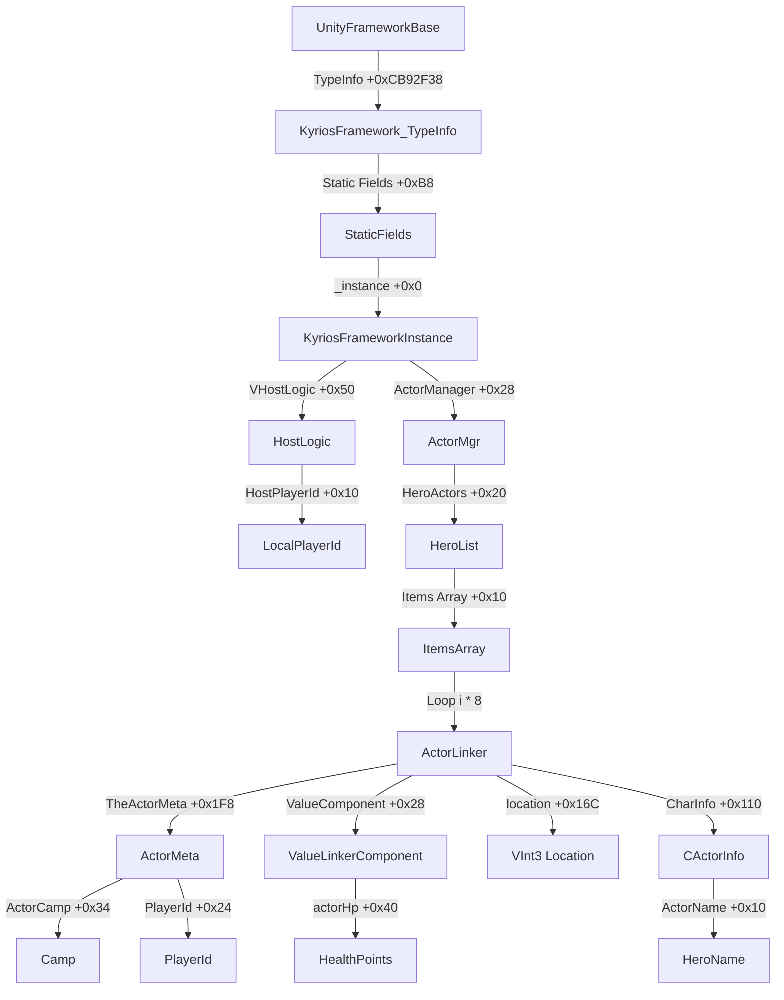

# HƯỚNG DẪN TÌM VÀ CẬP NHẬT OFFSETS CHO LÊN QUÂN MOBILE (AOV) ESP

Tài liệu này hướng dẫn cách tìm các offset quan trọng trong file binary `UnityFramework` của game khi game cập nhật phiên bản mới.

---

## 1. Cách tìm Địa chỉ TypeInfo (KyriosFramework & MainCamera)

Khi game update, địa chỉ của các `TypeInfo` (như `KyriosFramework_TypeInfo` và `MainCameraManager_TypeInfo`) sẽ thay đổi. Đây là các con trỏ tĩnh gốc để đi vào ActorManager và Camera.

### Cách 1: Sử dụng IDA Pro / Ghidra (Khuyên dùng)
1. Kéo file binary `UnityFramework` (đã được decrypted) vào IDA Pro hoặc Ghidra.
2. Đợi IDA phân tích xong hoàn toàn (nhìn thanh trạng thái góc dưới bên trái).
3. Nhấn **Shift + F4** hoặc vào menu **View -> Open subviews -> Names** để mở danh sách tên.
4. Tìm kiếm từ khóa:
   - `KyriosFramework_TypeInfo`
   - `MainCameraManager_TypeInfo`
5. Click đúp vào dòng tương ứng để chuyển đến địa chỉ ảo của nó ở phân vùng `.data` hoặc `.bss`.
6. Lấy địa chỉ đó trừ đi **Base Address** (nếu IDA load ở `0x100000000` thì trừ đi `0x100000000`, nếu load ở `0x0` thì giữ nguyên). Hiệu số này chính là offset dạng Hex (ví dụ: `0xCB92F38`).

---

### Cách 2: Sử dụng file `script.json` (từ Il2CppDumper)
Nếu bạn dùng **Il2CppDumper** để dump game, nó sẽ tạo ra file `script.json`. Bạn có thể tìm địa chỉ trực tiếp từ file này:
1. Mở file `script.json` bằng một editor hỗ trợ file lớn (như VS Code hoặc Notepad++).
2. Tìm kiếm chuỗi `"KyriosFramework_TypeInfo"` hoặc `"MainCameraManager_TypeInfo"`.
3. Bạn sẽ thấy một block JSON có dạng:
   ```json
   {
     "Address": 213463864,
     "Name": "KyriosFramework_TypeInfo"
   }
   ```
4. Đổi giá trị `"Address"` (hệ thập phân) sang hệ thập lục phân (Hex):
   - Ví dụ: `213463864` -> `0xCB92F38`.

---

## 2. Cách tìm và cập nhật Offset của các Fields (Trường dữ liệu)

Các offset bên trong Struct/Class ít khi thay đổi hơn địa chỉ TypeInfo, trừ khi cấu trúc code của nhà phát hành thay đổi lớn. Bạn có thể kiểm tra chúng trong file `dump.cs`.

Mở file `dump.cs` và tìm kiếm tên class cần xem:

### A. Tìm cấu trúc `ActorLinker` (Mỗi người chơi)
Tìm kiếm dòng: `public sealed class ActorLinker`
Các offset quan trọng cần check:
- `public ValueLinkerComponent ValueComponent; // Offset ví dụ: 0x28` -> Chứa lượng máu (HP).
- `public CActorInfo CharInfo; // Offset ví dụ: 0x110` -> Chứa tên Tướng (Hero Name).
- `public VInt3 _location; // Offset ví dụ: 0x16C` -> Tọa độ của người chơi trong game.
- `public ActorMeta TheActorMeta; // Offset ví dụ: 0x1F8` -> Chứa ID người chơi, Camp (phe ta/phe địch).

### B. Tìm cấu trúc `ActorManager` (Quản lý các Actor)
Tìm kiếm dòng: `public class ActorManager`
- `public List<PoolObjHandle<ActorLinker>> HeroActors; // Offset ví dụ: 0x20` -> Danh sách tất cả Tướng (Heros) trong trận đấu.

### C. Tìm cấu trúc `ActorMeta` (Thuộc tính cơ bản)
Tìm kiếm dòng: `public sealed class ActorMeta`
- `public uint PlayerId; // Offset ví dụ: 0x24` -> ID định danh người chơi.
- `public int ActorCamp; // Offset ví dụ: 0x34` -> Phe/Đội (để Team Check).

### D. Tìm cấu trúc `ValueLinkerComponent` (Chỉ số máu)
Tìm kiếm dòng: `public class ValueLinkerComponent`
- `private int <actorHp>k__BackingField; // Offset ví dụ: 0x40` -> Lượng máu hiện tại.

### E. Tìm cấu trúc `CActorInfo` (Thông tin Tướng)
Tìm kiếm dòng: `public class CActorInfo`
- `public string ActorName; // Offset ví dụ: 0x10` -> Tên nội bộ của Tướng.

---

## 3. Sơ đồ Traversal (Đường đi của code)

Để hiểu rõ cách code của chúng ta hoạt động trong file `esp.mm`:


